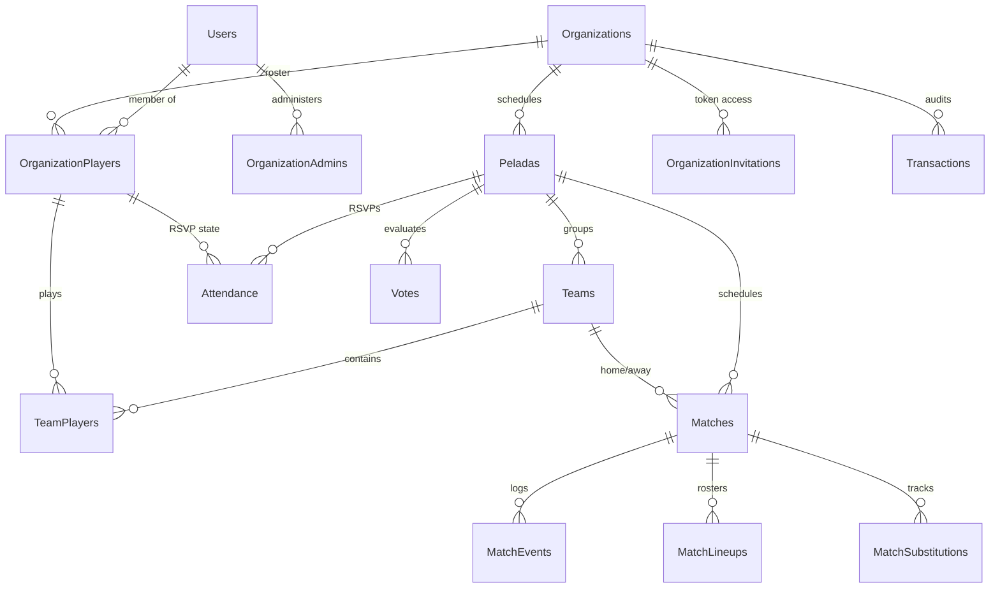

# 🏛️ PeladaApp: Technical Architecture & System Design

This document details the software architecture, component layers, data models, and technical algorithms powering PeladaApp.

---

## 🏗️ Architectural Paradigm

PeladaApp follows a decoupled full-stack architecture. The system is designed to isolate business rules from delivery mechanisms (web interfaces, APIs) and database systems.

```text
       +---------------------------------------------+
       |             Client (React App)             |
       +---------------------------------------------+
                              |
                     HTTPS (Cookie Auth)
                              |
                              v
       +---------------------------------------------+
       |            Nginx Proxy (Unified)            |
       +---------------------------------------------+
            |                                   |
         /api (Proxy)                       /waha (Proxy)
            |                                   |
            v                                   v
+-----------------------+           +-----------------------+
|  Clojure REST API     |           |  WhatsApp HTTP API    |
+-----------------------+           |        (WAHA)         |
            |                       +-----------------------+
      JDBC / HoneySQL
            |
            v
+-----------------------+
|   PostgreSQL Database |
+-----------------------+
```

---

## 🧱 Backend Architecture (Clojure REST API)

The Clojure backend (`api-peladaapp`) is structured according to **Clean Architecture** principles. Business rules reside in pure functions in the `logic/` namespace, and database interactions are isolated in the `db/` namespace.

### Namespace Breakdown

*   **`core.clj`**: Application bootloader. Starts the Component lifecycle system and runs Migratus database migrations.
*   **`components.clj`**: Lifecycle management using Stuart Sierra's Component library. Initializes the database connection pool (HikariCP), web server (Jetty), and core routes handler.
*   **`server.clj`**: Middleware pipeline configuration (Ring). Configures JSON parsing, CORS, and cookie-based authentication.
*   **`routes.clj`**: Compojure routing definition. Defines URL matchers and maps them to HTTP Handlers, applying Buddy Access Rules for authorization.
*   **`handlers/`**: Bridge between HTTP requests and controllers. Extracts parameters, delegates to controllers, and formats JSON responses.
*   **`controllers/`**: Application services layer. Orchestrates business logic, validates input schemas (Prismatic Schema), handles transactions, and interacts with the DB layer.
*   **`logic/`**: **Pure Functional Core**. Contains math, sorting, team balancing, and scheduling algorithms. Contains zero side effects, database calls, or HTTP references.
*   **`db/`**: Data access layer. Uses `HoneySQL` to build query maps and `next.jdbc` to execute statements against PostgreSQL.
*   **`models/` & `adapters/`**: Data validation definitions (Schemas) and adapter functions translating database rows (typically `snake_case` in SQL) to application maps (typically Clojure `kebab-case` keys).

---

## ⚛️ Frontend Architecture (React Single Page App)

The frontend codebase (`web-peladaapp`) uses a **feature-based directory structure** to ensure scalability and locate features rapidly.

```text
/src
├── app/                  # Application bootstrap, routing, and global Contexts
│   └── providers/        # Auth, Theme, and Language context providers
├── features/             # Business verticals (self-contained modules)
│   ├── auth/             # Login, logout, and registration screens
│   ├── home/             # Main organization listing and user landing
│   ├── organizations/    # Member roster, finance sheets, invite codes
│   ├── peladas/          # Attendance grids, team builder, match dashboard, voting
│   └── user/             # User settings and profile updates
├── shared/               # Reusable presentation and utility files
│   ├── api/              # Axios client instance, route declarations, type contracts
│   ├── components/       # Core UI widgets (Modals, Custom Buttons, Loaders)
│   └── hooks/            # Shared React hooks (e.g. useOrganizationFinance)
└── lib/                  # Configurations for third-party libraries (MUI, i18n)
```

---

## 🗄️ Database Schema & Relationships

The database is built on PostgreSQL. Below is an overview of the core database tables and their linkages:



### Table Glossaries
*   **`Users`**: Holds system credentials, emails, and global permissions (e.g., `allow_org_creation`).
*   **`Organizations`**: Scope boundary for matches and players.
*   **`OrganizationPlayers`**: Maps users to organizations. Stores position preferences, active status, member classifications (`mensalista`, `diarista`, `convidado`), and historical stats (goals, ratings).
*   **`Peladas`**: Match days. Maintains configuration (`num_teams`, `players_per_team`, `status`, `fixed_goalkeepers`).
*   **`Attendance`**: Links players to specific peladas with RSVP states (`confirmed`, `waitlist`, `declined`, `pending`).
*   **`Teams` & `TeamPlayers`**: Randomized group configurations generated for a pelada.
*   **`Matches`**: Tracks scheduling orders and scores.
*   **`MatchEvents`**: Chronological event logs for goals, assists, and cards.
*   **`Votes`**: Peers rating data (1-5 stars).
*   **`Transactions`**: Ledger of incomes and expenditures for accounting.

---

## 🧠 Key System Algorithms

### 🔀 1. Team Balancing: Bucket Shuffle
To prevent uneven teams while still introducing variety, team creation uses a **Bucket Shuffle** algorithm:
1.  **Selection**: Gathers all confirmed players for the pelada. Excludes any designated **Fixed Goalkeepers** who are pinned to specific team positions.
2.  **Grouping**: Group players by their preferred tactical position (`goalkeeper`, `defender`, `midfielder`, `striker`).
3.  **Bucketing**: For each position group, sort the players by their overall technical grade. Divide this sorted list into blocks (buckets) of size equal to the number of teams (`num_teams`).
4.  **Shuffle & Distribute**: Shuffle each bucket individually. This ensures that players of matching skill levels are randomized against each other. Distribute players sequentially from each bucket to the teams.
5.  **Greedy Compensation**: Evaluate the cumulative strength scores of the teams. If an imbalance exists, perform micro-swaps of players within the same tactical position to equalize total ratings.

### 🗓️ 2. Match Scheduling: Iterated Local Search (ILS)
Generating a fair match sequence for $N$ teams is modeled as an optimization problem:
*   **Goals**: Minimize back-to-back matches for any single team (avoiding player exhaustion) and minimize the maximum consecutive standby rounds (avoiding players cooling down).
*   **Algorithm**: An Iterated Local Search starts with a standard round-robin seed schedule, then applies randomized perturbations (e.g., swapping rounds or matches) and evaluates the sequence against a penalty cost function. It iterates to find the schedule with the lowest penalty score.

### 📊 3. Rating Normalization
Because users grade differently (some rate strictly, others give out 5 stars easily), the system normalizes voting values before updating profiles:
*   **Weighted Averages**: Calculate the average stars received by a player.
*   **Z-Score Normalization**: Compares a player's average stars against the mean and standard deviation of all votes cast in that specific pelada.
*   **Scale Mapping**: Maps the normalized Z-score onto a standard **1.0 to 10.0 scale** (Performance Index). This ensures ratings are comparable across different groups and match days.

---

## 🔐 Authentication & Session Security

PeladaApp implements strict cookie-based sessions:
*   **Token Delivery**: Authorization uses a signed JWT token stored inside the `authToken` cookie.
*   **No HTTP Headers**: Frontend clients **MUST NOT** append `Authorization: Bearer <token>` headers. The browser transmits the token automatically via standard cookies with every API call.
*   **Cookie Security Configuration**:
    *   **HttpOnly**: True in production to block access via malicious XSS scripts.
    *   **SameSite**: Lax, preventing cross-site transmission.
    *   **Secure**: Enabled in production to guarantee HTTPS-only delivery.
