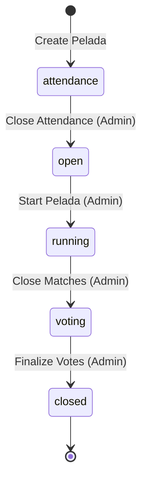

# ⚽ PeladaApp: User Features & Product Guide

PeladaApp is a full-stack platform designed to take the operational headache out of organizing casual soccer matches ("peladas") with friends. It automates RSVP tracking, team balancing, match scheduling, stats logging, and performance voting.

---

## 👥 User Roles & Access Control

The platform enforces a role-based authorization model across all endpoints and UI screens:

*   **Regular User / Player**:
    *   Register and maintain a player profile (name, username, position, phone number, avatar).
    *   RSVP to upcoming match days (Confirm, Decline, or default to Pending).
    *   View active match days, lineups, schedules, and standings.
    *   Participate in post-match voting for peers.
    *   View organization statistics and player ratings.
*   **Organization Administrator**:
    *   Invite players via email or invitation links.
    *   Manage player memberships (Mensalista, Diarista, Convidado) and edit technical cards/attributes.
    *   Configure organization finances (monthly fee, pay-per-play fee) and track payments.
    *   Create peladas, close attendance, generate balanced teams, and customize match schedules.
    *   Control live match playback: record scores, substitutions, and events (goals, assists, cards).
    *   Toggle voting stages and access administrative statistics.
*   **System Global Admin**:
    *   Administrative backend access to authorize users to create new organizations (`allow_org_creation = true`).

---

## 🔄 Core Product Flows

### 1. Onboarding & Member Management
The lifecycle of an organization begins with onboarding players:

*   **Registration**: Users register with basic contact and tactical details (preferred position: Goalkeeper, Defender, Midfielder, Striker).
*   **Invitations**: Organization Admins send email invitations. The system generates a first-access link: `/first-access?token=<token>&email=<email>`.
*   **First Access**: The invited player clicks the link, enters a password, registers their profile, and is automatically added to the organization's roster.
*   **Membership Classification**:
    *   **Mensalista**: Monthly subscriber. They have absolute priority during attendance confirmation.
    *   **Diarista**: Pay-per-play member. They join peladas depending on slot availability.
    *   **Convidado**: Guests invited to fill remaining vacancies.

*   **Player Characteristics & Radar Graph**:
    To help administrators visualize and manage player skill sets, each player card displays a 6-axis **Radar Graph** mapping tactical and technical metrics. Admins can update these values (ranging from `0` to `5`) using sliders:
    *   **Passing**: Accuracy, execution, and tactical vision.
    *   **Ball Control**: Quality of first touch and ball retention.
    *   **Velocity**: Speed with and without the ball.
    *   **Shooting**: Power, accuracy, and finishing capability.
    *   **Dribbling**: Agility, creativity, and 1v1 performance.
    *   **Defending**: Positioning, tracking, tackling, and marking.

---

### 2. Pelada (Game Day) Lifecycle

Every match day progresses through a strict state machine:
`attendance` ➔ `open` ➔ `running` ➔ `voting` ➔ `closed`

#### 📅 Phase A: Attendance & RSVPs
*   When a Pelada is created, it enters the **attendance** phase.
*   Players submit their RSVP status (`confirmed` or `declined`).
*   **Access Priority**:
    *   Mensalistas who confirm are automatically placed in the main roster.
    *   Diaristas and Convidados are confirmed up to the configured roster limit. If the capacity is exceeded, they are automatically placed on a **Waitlist**.
*   **Sorting Rules (Critical)**:
    *   **Attendance & Waitlists**: Players are sorted primarily by their membership type priority (**Mensalista > Diarista > Convidado**) and then by their update time (**FIFO** - First In, First Out). If update time is missing, it falls back to alphabetical sorting by name.
    *   **Tactical Displays**: For notifications and print-outs, the roster is sorted by football position (**Goalkeeper > Defender > Midfielder > Striker**) and then alphabetically.

#### 🔀 Phase B: Team Generation & Randomization
*   Once attendance is closed, the pelada enters the **open** phase.
*   The system dynamically allocates players into a configured number of teams (`num_teams`) of a specified size (`players_per_team`).
*   **Bucket Shuffle Algorithm**:
    *   To balance competitiveness and variety, players are grouped by position and sorted by their overall rating.
    *   Within each position, players are divided into "buckets" matching the number of teams.
    *   Each bucket is shuffled individually, and players are greedily assigned to teams to minimize the standard deviation of total team scores.
*   **Fixed Goalkeepers**:
    *   Admins can designate specific players as **Fixed Goalkeepers** (Home/Away).
    *   Fixed Goalkeepers are excluded from the main randomization pool and locked to their respective teams to ensure they do not get shuffled out of their tactical positions.

#### 🗓️ Phase C: Match Scheduling
*   The schedule is generated based on the number of teams using an **Iterated Local Search (ILS)** algorithm.
*   This generates an optimal round-robin match matrix that minimizes player wait times (ensuring teams do not sit out for too long) and balances matches.
*   Admins can manually adjust match orders, swap teams, or add matches before pushing the schedule live.

#### ⏱️ Phase D: Live Match Tracking
*   Starting the Pelada transitions the state to **running**.
*   Admins control the active match dashboard:
    *   Record real-time events: Goals, Assists, Own Goals, Yellow/Red Cards.
    *   Manage **Lineups** and log **Substitutions**.
    *   **Substitutions**: Supports both temporary player swaps (during gameplay) and permanent monthly substitution rules.
*   A real-time scoreboard tracks standings (Points, Wins, Goal Difference, Goals Scored).

#### ⭐ Phase E: Post-Game Voting & Normalized Scores
*   After all matches finish, the pelada enters the **voting** phase.
*   All participants can rate their peers on a **1 to 5-star scale** via their dashboards.
*   **Anti-collusion Rules**: Self-voting is strictly blocked.
*   **Normalized Ratings**:
    *   Raw votes are aggregated and run through a normalization algorithm to map averages onto a **1 to 10 scale**.
    *   This normalizes variances (e.g., if one group votes strictly and another votes leniently).
    *   The resulting score updates the player's core characteristics on their profile card and radar graph, adjusting their weighting for future team randomizations.

---

### 3. Financial Tracking & Auditing
Organizations can track monthly collections and match-day fees:
*   **Monthly Payments**: Tracks Mensalista subscriptions. Shows unpaid vs. paid status for each month.
*   **Diarista Fees**: Tracks pay-per-play fees for every match. The UI supports one-click "Mark Paid" buttons next to confirmed diaristas on the attendance roster.
*   **Transaction Log**: Every payment creates an audit trail inside the database under incomes (`diarista_fee` or `monthly_subscription_fee`).

---

### 💬 4. WhatsApp Notifications (WAHA)
The platform integrates with the **WhatsApp HTTP API (WAHA)** to push automated messages directly to chat groups:
*   **Game Call (Convocação)**: Sent when a pelada is created, prompting players to RSVP. Includes a list of current confirmations.
*   **Lineups & Teams**: Sent after teams are randomized, listing players by position (GK > DF > MF > ST) for each team.
*   **Final Results**: Sent when the pelada is closed, summarizing match scores, final standings, and top performers.
